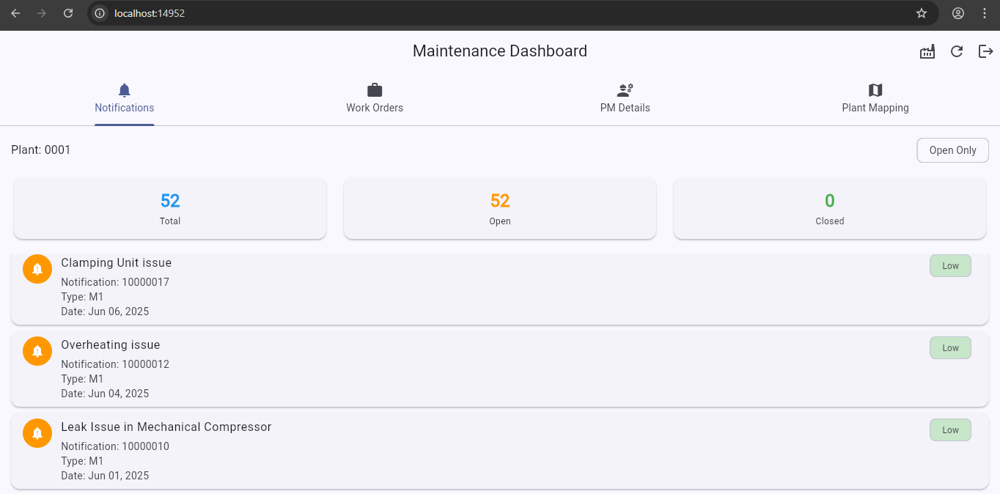

# Maintenance Portal (PM)

A portal for maintenance engineers to track and manage equipment notifications, work orders, and maintenance history, ensuring machines in the plant run smoothly.

## UI Frontend

