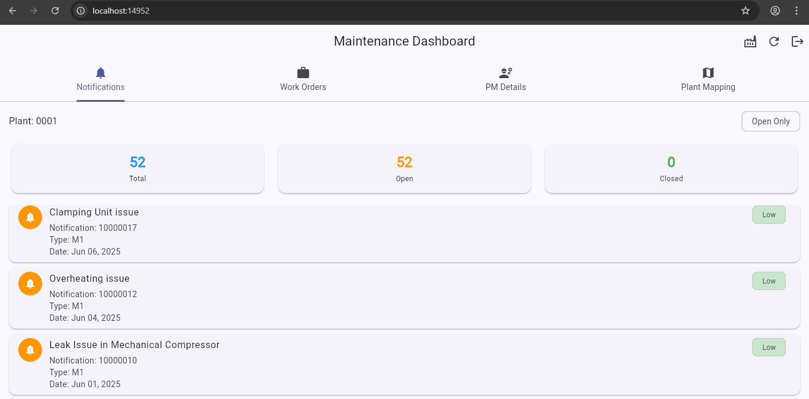

# Maintenance Portal (PM)

Developed using Flutter, this mobile-friendly portal connects maintenance engineers to SAP systems for viewing notifications, work orders, and maintenance activities in real-time.

## UI Frontend

